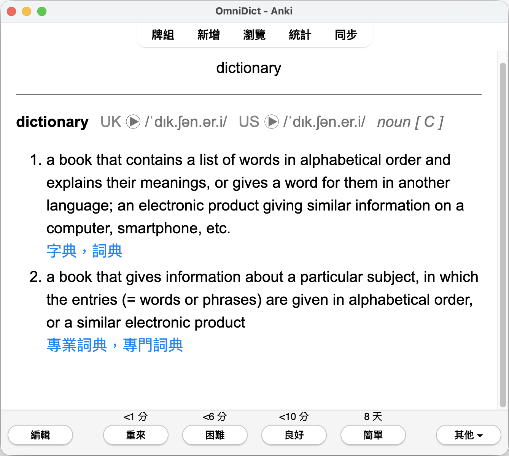

# OmniDict

**Omnidict is the only Anki dictionary add-on you'll ever need.**

It seamlessly integrates multiple dictionaries, letting you create definition cards effortlessly.
The definition field is fully customizable — choose whether to include *pronunciation audio*,
*phonemic transcriptions*, *translations* and *examples*.
Cards created by this add-on work on all platforms.

## Features

- Add definitions, translations, pronunciation audio, phonemic transcriptions, and examples to your cards (fully customizable).
- Multiple dialect support (e.g., British and American English).
- Dark mode support.
- Cards work on Anki, AnkiDroid, Anki Mobile, and AnkiWeb.
- Dictionary support
  - Cambridge Dictionary
    - Cambridge English–Chinese (Simplified) Dictionary
    - Cambridge English-Chinese (Traditional) Dictionary
  - more to come, contributions welcomed!

## Installation

### AnkiWeb

The easiest way to install OmniDict is through AnkiWeb.

### Manual installation

1. Download the latest `.ankiaddon` file from the releases tab (you might need to click on Assets below the description to reveal the download links)
2. Open the folder where your downloads are located and double-click on the downloaded .ankiaddon file.
3. Follow the installation prompt and restart Anki if it asks you to

## Contributing

Contributions are always welcome!

See `contributing.md` for ways to get started.

Please adhere to this project's `code of conduct`.

